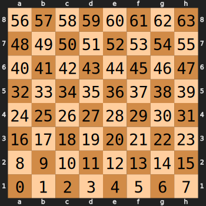

Arduino Code
============

The code running on Arduino is quite straightforward: it continuously scan the chess board and detect which squares are occupied.

Each scan will produce a list of numbers indicating the square where a piece had been detected, below is the numbering convention.

At the beginning of the match, when all pieces are in their starting square, the output list will be the following:

.. code-block::
   
   [0, 1, 2, 3, 4, 5, 6, 7, 8, 9, 10, 11, 12, 13, 14, 15, 48, 49, 50, 51, 52, 53, 54, 55, 56, 57, 58, 59, 60, 61, 62, 63]

.. note::
   This list does not give any information concerning the color or the type of the piece, it only tells whether a square is occupied or not. 
   
Examples
^^^^^^^^

Code
----

.. literalinclude:: ../Software/Python/SerialCommunication.py
   :language: python
