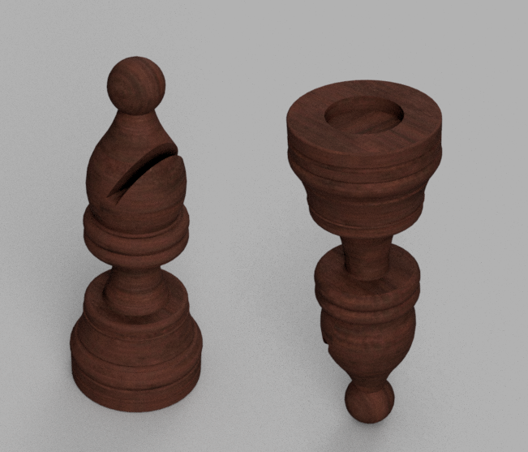

The Chessboard
==============

A cheap MDF chessboard had been used.

.. image:: images/chessboard_render_top.png

A total of sixtyfour holes had been made on the back of each square, in order to make room for the sensor boards and guarantee a minimum distance 
between the top plane (where magnets will be) and the sensor itself.

.. image:: images/chessboard_render_bottom.png

.. tip::
   For this operation a CNC is the best solution, unfortunately not everyone has got one in their garage... 
   In this case a good old hand drill, with a 25mm forstner bit, will do the job.

In addition, every piece has to be modified by making a hole underneath the base, there is where the magnet will be glued.

.. image:: images/chessboard_tech_dimensions_piece_section.png
   
The Wiring Madness
------------------

Each sensor requires a couple of wires and they have to be connected in a grid configuration.
