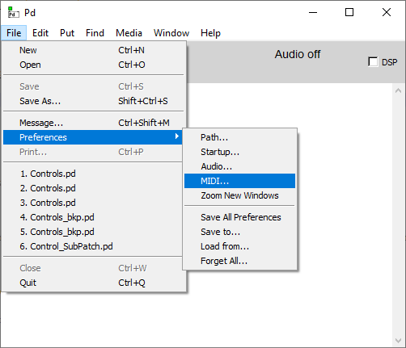
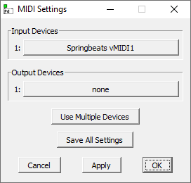

Getting Started
===============

Follow this guide to quickly start your first session.

Virtual MIDI Cable
------------------

Download and install `Virtual MIDI Cable <https://springbeats.com/sbvmidi/>`_. 
This will create a virtual audio device on your computer with a total of eight MIDI input/output virtual cables.

PureData
--------

Download and install `PureData <https://puredata.info/downloads/pure-data>`_, then confgure the MIDI input as follow:

Last step is to open the :download:`example.pd <attachments/example.pd>` patch and activate DSP mode from *PureData* main window.

Download the Application
------------------------

The core of this project is the Python application: is where all the *magic* happens.

.. image:: images/gui_mainwindow.png

From this window it's possible to load a pre-saved match and start the execution in **auto mode** (this does not even require a physical chessboard).

#. Configure the MIDI communication from the menu **Config** -> **MIDI**.

   .. note::
   
      Make sure to select **the same MIDI device** already configured in *PureData*.
	  
#. From the **File** menu, load the :download:`deep_blue_kasparov_1996.pgn <attachments/deep_blue_kasparov_1996.pgn>` match.

Once the match file has been loaded, the application should run and you shuld be able to hear something...

Get a Working Chessboard
------------------------

Now that you succesfully run your fisrt session, it's time to add a real chessboard and start the **live mode**.

You can get an already made chessboard or go DIY.
The process of makig it by yourself is quite straightforward however, some basic soldering and programming skills are required.
