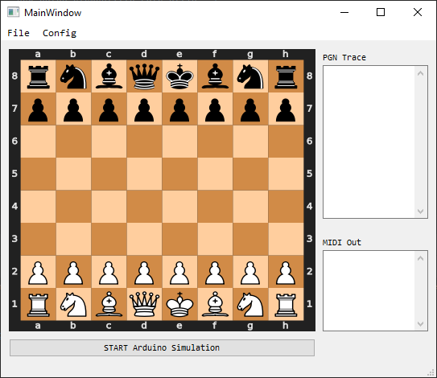

Getting Started
===============

Follow this guide to quickly start your first session.

Download the Application
------------------------

The core of this project is the Python application: is where all the *magic* happens.

From this window it's possible to load a pre-saved match and start the execution in **auto mode** (this does not even require a physical chessboard).

#. Open the Pure Data patch named ``Example.pd``.
#. Configure the MIDI communication.
#. From the **File** menu, load the ``deep_blue_kasparov_1996.pgn`` match.

Once the match file has been loaded, the application should run and you shuld be able to hear something...

Get a Working Chessboard
------------------------

Now that you succesfully run your fisrt session, it's time to add a real chessboard and start the **live mode**.

You can get an already made chessboard or go DIY.
The process of makig it by yourself is quite straightforward however, some basic soldering and programming skills are required.
