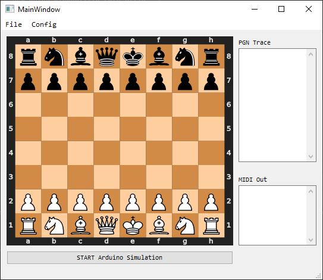
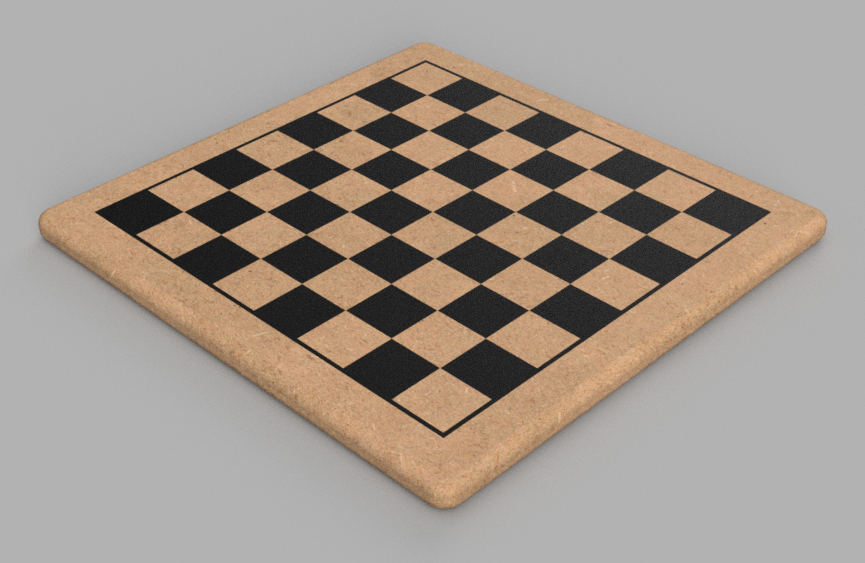
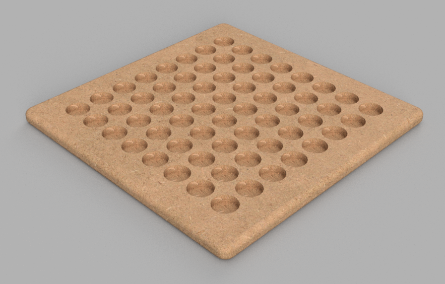

.. PureChess documentation master file, created by
   sphinx-quickstart on Fri Nov 11 19:59:03 2022.
   You can adapt this file completely to your liking, but it should at least
   contain the root `toctree` directive.

Welcome to PureChess's documentation!
=====================================

An Arduino-based chessboard that can interact with a PureData patch.

Getting Started
---------------

Modifying the Chessboard
------------------------

A cheap MDF chessboard had been used.

A total of sixyfour holes had been made on the back of each square, in order to make room for the sensor boards and guarantee a minimum distance 
between the top plane (where magnets will be) and the sensor itself.

.. tip::
   For this operation a CNC is the best solution, unfortunately not everyone has one in their garage... 
   In this case a good old hand drill, with a 25mm forstner bit, will do the job.
   
The Wiring Madness
------------------

Each sensor requires a couple of wires and they have to be connected in a grid configuration.

List of Materials
-----------------

+---------------------+------+
| Item                | Q.ty |
+=====================+======+
| Chess board         | 1    |
+---------------------+------+
| Chess piece         | 32   |
+---------------------+------+
| Magnet              | 32   |
+---------------------+------+
| Arduino UNO R3      | 1    |
+---------------------+------+
| Reed switch         | 64   |
+---------------------+------+
| :doc:`sensor_board` | 64   |
+---------------------+------+
| :doc:`master_board` | 1    |
+---------------------+------+

.. toctree::
   :maxdepth: 2
   :caption: Software:
   :hidden:
   
   arduino_code
   python_application

.. toctree::
   :maxdepth: 2
   :caption: Hardware:
   :hidden:
   
   sensor_board
   master_board
   
