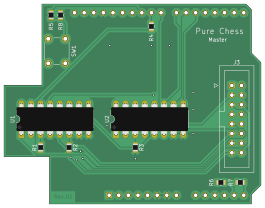
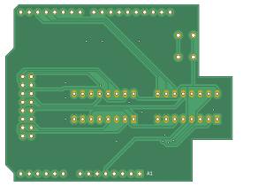

Master Board
============

The master board contains all the circuitry to implement a simple scanning matrix. Its form factor allows a direct mounting on top of an 
*Arduino UNO R3*.

   

The circuit consists of two *CD4051* 8x1 multiplexer, one for the rows and one for the columns of the chessboard (for a total of sixtyfour combinations).
The control addresses are generated directly by Arduino, which reads the output of the matrix and provides power supply to the board.

A common *IDC-16* connector is used to accomodate the sensors harnesses.
   
.. warning::
   This board can only handle reed switches, it's not compatible with hall effect sensors.