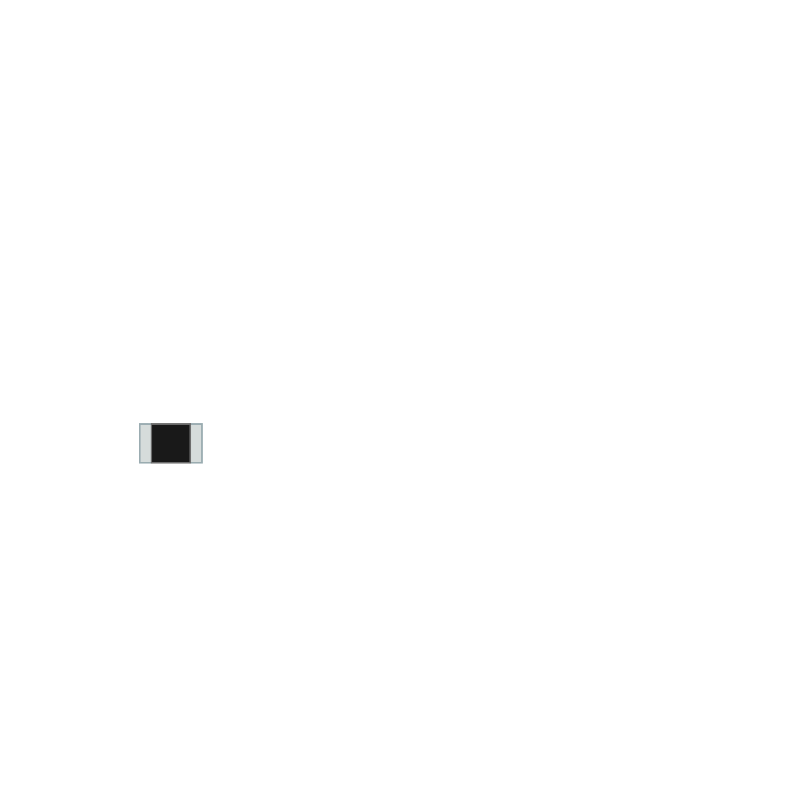

Sensor Board
============

This board had been designed to perfectly fit the 25mm holes under each square of the chessboard, providing both a consistent positioning of the sensors 
themselves and a *clean* way to implement all the connections.

.. image:: images/sensor_board_back.svg
   :width: 250

Two different mounting options are available.
   
Reed Switches
-------------

The simplest solution is to populate with one reed switch **SW1** or **SW2** on the back side of the board.

.. note::
   Tests showed that one reed switch is enugh to detect when a magnet is placed above it, however an additional one can be mounted.

On the top side, an optional LED (in combination with a 1kΩ resistor) can be mounted to have a visual feedback when the reed switches are being triggered.

Hall Effect Sensor (not tested)
-------------------------------

Alternatively, an hall effect sensor mounted on **U1**, can be used.

.. warning::
   After early tests this solution had been avoided for a few reasons:
   
   - The master board need additional circuitry.
   - One more cable has to be soldered to each sensor board.
   - Digital sensors (*A3144*) seems less sensistive than the reed switches.
   - Analog sensors (*49E*) require even more additional circuitry.
