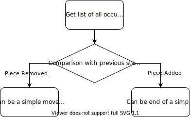

# Pure Chess
## Overview
An Arduino-based chessboard that can interact with a _PureData_ patch.

## Ideas
Arduino scanning matrix of 8x8 hall effect sensors (or alternatively reed switches) that are activated using tiny magnets below the chess pieces.
The chessboard is not able to recognize each single piece, it can only detect if a certain tile is occupied or not, for this reason a Python script must keep track of all the pieces on the board.

Python way to move a piece on the board:
`Move.from_uci('g1f3')`

Arduino should provide the string `g1f3`, according to the state of the sensors.

## Wishlist

- Possibility to "play" famous match, by reading a file containing all the moves.
- Saving live match.
- Remote games..?

## Useful Links
- [Arduino Schematic and Code editor](https://www.circuito.io/)
- [Python Chess](https://python-chess.readthedocs.io/en/latest/)
- [Pure Data on RaspberryPI](https://puredata.info/docs/raspberry-pi)
- [List of Pure Data objects (refere to Vanilla)](https://puredata.info/docs/ListOfPdExternals/)
- [Pure Data MIDI tutorial](https://puredata.info/Members/fgadea/using-pd-with-a-midi-controller/at_download/file)
- [The Theory and Technique of Electronic Music](http://msp.ucsd.edu/techniques/latest/book.pdf) (chapter 3.2 for control timing)

## How does Arduino manage the chess board?
Each piece has got a magnet on the bottom, which will activate a sensor under each square.
Arduino continuously scans all the 64 sensors (approximately every 100ms) and creates a list of _occupied squares_.

For instance, at the very beginning of the game the value of the list is as follow:

`[0, 1, 2, 3, 4, 5, 6, 7, 8, 9, 10, 11, 12, 13, 14, 15, 47, 48, 49, 50, 51, 52, 53, 54, 55, 56, 57, 58, 59, 60, 61, 62, 63]`

Then the list containing the _actual status_ is compared to the _stored status_ and all possible cases are mapped.

